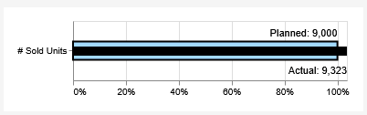
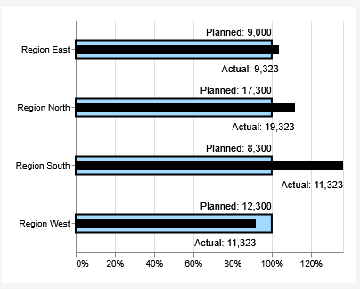

# deneb / vega lite examples
examples of deneb visuals for visualisation within power bi.

# about me
I am a freelance power bi consultant 

# motivation
I love Power BI. But sometimes the core visuals do not offer the flexibility that I need to design impressing reports. 
And some of the improviements in the core visuals are very complicated to use - and there is some standardisation lacking that visuals will always look the same when I use them.

So my goal is to implement a set of beautiful vega / vega lite powered visuals that can easily be used and reused. Configuration should be kept as simple as possible. 

Thanks to Daniel-Marsh Patrick (https://github.com/dm-p) for your wonderful idea in bringing vega / vega-lite to power bi by inventing deneb.

# usage
Use the _pbi.json files within deneb in power bi.
Use the vega_lite.* files just within vega lite, for example in https://vega.github.io/editor/#/edited 

# examples

## Two Measure Compare
This is designed to compare two measures, a 'Base' value and an 'Actual' value. The difference between both is displayed in percent and absolute values. Use this to compare actuals vs. plan values or values between different points in time (e.g. comparison with last year). Optionally, you can add a third category value named 'Attribute'. Then the comparison between 'Base' and 'Actual' is performed for each '<'Attribute'. In an IBCS manner, the chart is scaled identically for all 'Attributes'. Use the params section to define colors and text.

Here an example of the single element version:  

 And the multiple element version: 

