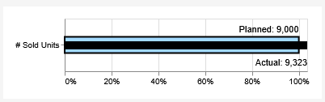
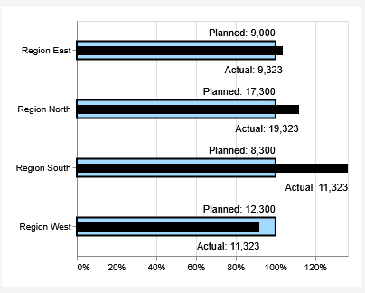
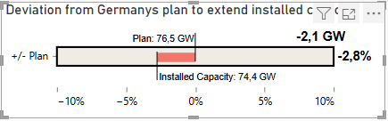
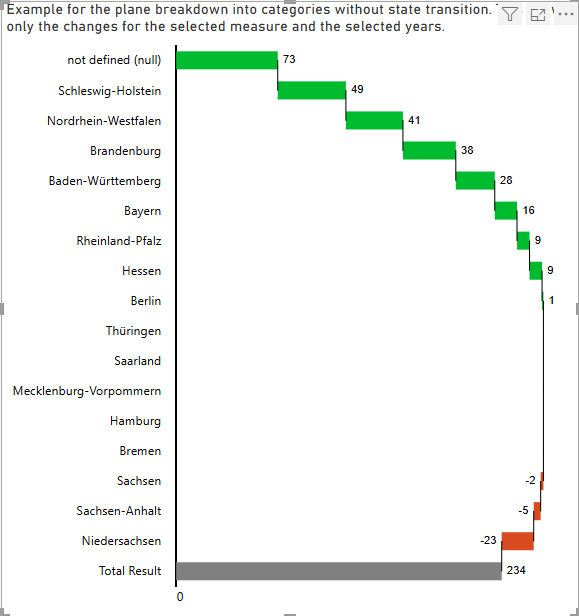
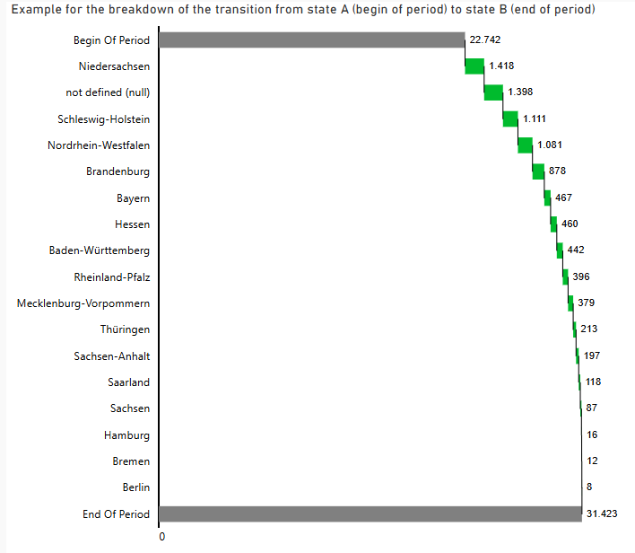

# deneb / vega lite examples
examples of deneb visuals for visualisation within power bi.

# about me
I am a freelance power bi consultant located in Aachen, Germany (https://paulmoldmann.de).

# motivation
I love Power BI. But sometimes the core visuals do not offer the flexibility that I need to design impressing reports. 
And some of the improviements in the core visuals are very complicated to use - and there is some standardisation lacking that visuals will always look the same when I use them.

So my goal is to implement a set of beautiful vega / vega lite powered visuals that can easily be used and reused. Configuration should be kept as simple as possible. 

Thanks to Daniel-Marsh Patrick (https://github.com/dm-p) for your wonderful idea in bringing vega / vega-lite to power bi by inventing deneb.

# usage
Use the _pbi.json files within deneb in power bi.
Use the vega_lite.* files just within vega lite, for example in https://vega.github.io/editor/#/edited 

# examples

## Two Measure Absolute Compare
This is designed to compare two measures, a 'Base' value and an 'Actual' value. The difference between both is displayed in percent and absolute values. Use this to compare actuals vs. plan values or values between different points in time (e.g. comparison with last year). Optionally, you can add a third category value named 'Attribute'. Then the comparison between 'Base' and 'Actual' is performed for each '<'Attribute'. In an IBCS manner, the chart is scaled identically for all 'Attributes'.   
Use the params section to define colors and text.

Here an example of the single element version:  

 And the multiple element version: 

## Two Measure Relative Compare
This is also designed to compare two measures, a 'Base' value and an 'Actual' value. But focuses to display the relative devition by centering on 0% and displaying the deviation of the actual value from the base value. 
Optionally, you can add a third category value named 'Attribute'. Then the comparison between 'Base' and 'Actual' is performed for each '<Attribute>'. In an IBCS manner, the chart is scaled identically for all 'Attributes'.  
Use the params section to define colors and text.

Here an example of the single element version:  

## Vertical waterfall (basic ideas from IBCS)

In the IBCS standard, the horizontal waterfall chart is only supposed to be used with temporal data. But oftentimes we are also interested in the breakdown of data using a waterfall chart for data that is not temporal. In this case, IBCS suggests to use vertical waterfall charts. 
Unfortunately, the power BI standard visual is not capable of displaying vertical waterfall charts.
Furthermore, the IBCS waterfall chart is supposed to display the transition from a state A to a state B by showing a breakdown into categories where state A might be previous year values and state B actual values. 
This kind of display is also not supported by the standard power bi visual. 
I have created two visuals using the powerful deneb custom visual by Daniel-Marsh Patrick showcasing vertical waterfall:
1. 'ibcs_vertical_waterfall_wo_start':  This shows the pure breakdown of a measure into categories. There is no display of a transition. In the linked example in my power_bi repository, it shows the changes in installed power units with a breakdown into federal states. This is in fact more a vertical version of the standard poewr BI visual

 2. 'ibcs_vertical_waterfall_with_start':This shows the transition from state A to state B while displaying the breakdown into categories. In the linked example in my power_bi repository, it shows the change in the installed power units in Germany from the beginning of the selected years until the end of the selected years with a breakdown into federal states. This tries to implement basic ideas from IBCS.

 Both visuals have a lot parameters, so try out and explore :-) 
Attention: the JSON Files for the vertical waterfall charts are optimized for usage within power bi. Some slight adapations are needed for them to work properly outside of power bi.
See also my power bi repository where you can find a working example of this within power BI: https://github.com/pmoldmann/power_bi